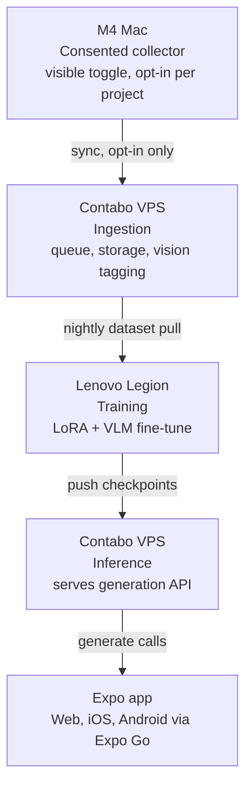

# 01 - Architectural blueprint

## 1. System diagram



Five stages, one direction of data flow at rest, two directions of control flow
(the app calls the inference API on demand; everything upstream of it runs on
a schedule). No stage is silent to the person whose data it touches - see
§4 for what that means concretely for the collector.

## 2. Technology stack

### Mac collector (`collector-mac`)
- **Sync agent**: Python 3.11 + `watchdog` for filesystem events, packaged as
  a `rumps`-based menu-bar app (or a small Swift `NSStatusItem` app if you'd
  rather ship a native binary - both are described in doc 02). `launchd` still
  handles auto-start at login; what changed from the original ask is that the
  agent it starts is visible and toggleable, not headless.
- **Photoshop/Illustrator integration**: a **UXP plugin** (Adobe's current
  extensibility platform), not classic ExtendScript/CEP. UXP gives you a real
  panel with a visible on/off toggle for free, which is what the consent
  requirement needs; ExtendScript's "log silently, no popups" pattern is
  exactly the pattern this project avoids.
- **File parsing**: `psd-tools` for reading layer trees, bounding boxes, and
  color data out of `.psd` files without needing Photoshop running.

### Backend / cloud (Contabo VPS)
- FastAPI (async, Pydantic v2) for the ingestion and inference APIs.
- PostgreSQL (self-hosted or Supabase-managed) for structured metadata, accessed
  through **SQLModel** (thin async layer over SQLAlchemy 2.0, reuses the same
  Pydantic-style models the API already returns) with **Alembic** for
  migrations. See §7 for why this beats reaching for a JS/TS ORM here.
- Redis + Celery for the ingestion queue and background vision-tagging jobs,
  and doubling as the pub/sub backend for real-time generation progress (§7).
- **python-socketio**, mounted onto the FastAPI ASGI app, for pushing
  generation progress to the Expo client - see §7 for why Socket.IO over a
  plain WebSocket here specifically.
- Object storage for the actual export files: Contabo Object Storage (S3-compatible)
  or a Contabo-mounted volume, depending on budget - either works with the same
  `boto3`/`aioboto3` client code.
- Docker Compose to run the whole stack (api, worker, redis, postgres, nginx)
  as one unit; Nginx as reverse proxy + TLS termination (Let's Encrypt via
  `certbot` or Caddy if you'd rather not manage certs by hand).

### ML / data pipeline (Lenovo Legion)
- PyTorch 2.x, Hugging Face `diffusers`, `peft` for LoRA.
- Style model: Flux or SDXL LoRA (choice depends on confirmed VRAM - see §5).
- Layout/composition model: Qwen2.5-VL or Llama 3.2 Vision, fine-tuned with
  `peft` (LoRA/QLoRA) rather than full fine-tune, again pending VRAM.
- `rsync`/`rclone` over a WireGuard or Tailscale tunnel for the nightly pull
  from the VPS.

### Frontend / client
- React Native + Expo SDK 51+, Expo Router for file-based navigation,
  NativeWind for Tailwind-style styling, runnable on Web and in Expo Go
  without a dev client build.

## 3. Data schema

Metadata extracted per design file, stored as JSON alongside the row in
Postgres (or as the row's JSONB column, if you'd rather not model every
field relationally on day one):

```json
{
  "asset_id": "b3f1e2a0-...",
  "source_project": "client-rebrand-2026",
  "captured_at": "2026-08-29T09:14:00Z",
  "file": {
    "original_name": "hero-banner.psd",
    "format": "psd",
    "canvas": { "width": 1600, "height": 900, "dpi": 72 }
  },
  "layers": [
    {
      "layer_id": "L01",
      "name": "Headline",
      "type": "text",
      "z_index": 4,
      "bbox": { "x": 120, "y": 80, "width": 640, "height": 96 },
      "typography": {
        "font_family": "Neue Haas Grotesk",
        "font_size": 64,
        "font_weight": 700,
        "letter_spacing": -0.02,
        "line_height": 1.05
      },
      "color": { "hex": "#1A1A1A", "opacity": 1.0 }
    },
    {
      "layer_id": "L02",
      "name": "Background shape",
      "type": "shape",
      "z_index": 1,
      "bbox": { "x": 0, "y": 0, "width": 1600, "height": 900 },
      "color": { "hex": "#F2A623", "opacity": 1.0 }
    }
  ],
  "palette": ["#1A1A1A", "#F2A623", "#3B8BD4", "#FFFFFF"],
  "consent": {
    "project_opted_in": true,
    "captured_by_agent_version": "0.3.0"
  }
}
```

`bbox` and `typography` feed the layout/VLM model; `palette` and per-layer
`color` feed the style LoRA's caption/conditioning data; `consent` is written
by the collector itself on every record, so ingestion can reject anything
that didn't come from an opted-in project - a second, structural enforcement
of §4 below, not just a policy on paper.

## 4. The collector's consent design, concretely

This is what "opt-in and visible" cashes out to in the architecture, so it's
not just a value statement floating above the code:

- The designer opts a **project folder** in, not "everything on my Mac."
- The menu-bar icon shows one of three states at all times: off, watching a
  named project, paused. No fourth, invisible state.
- Every capture event is appended to a plain-text local log the designer can
  open with one click from the menu.
- Pausing or fully revoking access takes effect immediately, client-side,
  before any network call - the agent doesn't need to reach the VPS to stop.
- The ingestion API rejects payloads whose `consent.project_opted_in` is
  false or missing (see doc 02 for the actual check).

## 5. Trade-offs worth deciding deliberately

### Where does image generation actually run? (resolved)
Confirmed: the Contabo VPS has no GPU, and the Legion's RTX 5060 has 8GB
VRAM. That's enough to settle this rather than leave it open:

- **Inference runs on the Legion** - SDXL inference (as opposed to SDXL
  *training*, which is the tight one) fits comfortably in 8GB, no
  quantization tricks needed. Tunnel it in over Tailscale/WireGuard; the
  Contabo VPS stays the stable public gateway (DNS, TLS, a consistent API
  contract for the Expo app) and proxies `/generate` calls through the
  tunnel to the Legion.
- **Burst GPU rental is the fallback**, not the primary path - for whenever
  the Legion is mid-training run, powered off, or off the network. Route to
  it automatically if the tunnel to the Legion is unreachable, rather than
  failing the request.
- **Upgrading the VPS to Contabo GPU Cloud is no longer worth it** given the
  above - it would mean paying ~$790+/month for GPU capacity the Legion
  already provides for free at the one workload (inference) it's actually
  comfortable with.

This means the "Contabo VPS - inference" box in §1's diagram is really an
**inference gateway that proxies to the Legion**, not a machine that runs
the model itself - worth keeping straight when you get to Phase 2/3, since
the FastAPI route for `/generate` needs to make an outbound tunneled call
rather than load a checkpoint locally.

### Vector (SVG) vs. raster (diffusion) generation
- **Raster (Flux/SDXL LoRA)** captures painterly texture, photographic
  elements, and organic style far better, but output is a fixed bitmap -
  no editable layers, no infinite scaling, no easy recoloring.
- **Vector (SVG, generated from the layout model's structured output)** gives
  you infinitely scalable, editable, on-brand output and is a natural fit for
  the "signature layout" half of the problem (typography, composition,
  color blocking), but currently no generative model produces high-quality
  freeform vector art the way diffusion models produce raster art.
- **The practical answer for this project is both, at different layers**: the
  layout/VLM model proposes structure (bounding boxes, typography, color
  blocking) as vector-friendly JSON - rendered directly as SVG/CSS in the
  Expo canvas preview - while the style LoRA generates raster texture/imagery
  *within* that structure where a purely vector look wouldn't match the
  designer's actual aesthetic. Doc 04 shows how the canvas preview renders
  the vector layer; doc 03 shows how the raster layer gets generated.

## 6. ORM and real-time layer

**Why not Prisma or Drizzle.** Both are excellent, but both are TypeScript
tools, and the backend here is Python/FastAPI on purpose - it's the same
language as the PSD parsing, the ingestion validation, and (via `psd-tools`)
the training data prep, so keeping the ORM in Python avoids a second
runtime, a second migration tool, and a second deploy unit for no functional
gain. **SQLModel** (built by the same author as FastAPI, a thin async layer
over SQLAlchemy 2.0) is the closer fit: it reuses the Pydantic-style models
the API already defines for request/response bodies, so the asset schema in
§3 doesn't need to be written twice. Pair it with **Alembic** for migrations
- run as an explicit one-off command (`docker compose run api alembic
upgrade head`), not an implicit auto-migrate on boot.

If a separate Node-based surface ever gets added to this project - an admin
dashboard for reviewing captured assets and consent logs is the most likely
candidate - **Drizzle over Prisma** for that specific service: no separate
query-engine binary, schema defined as plain TypeScript close to the actual
SQL, lighter cold start. Prisma's stronger points (a nicer migration/studio
UI, a more mature ecosystem) matter more at team scale than they do for a
two-person side project. This is a recommendation for *if* a Node service
appears, not a suggestion to add one - nothing in the current plan needs it.

**Real-time generation progress.** A `/generate` call can take anywhere from
seconds to a minute depending on which inference option from §5 you land on
- too long for a plain request/response round trip to feel responsive, and
too long to poll gracefully from a mobile client that may background mid-job.
**python-socketio**, mounted onto the FastAPI ASGI app and backed by the
Redis instance already in the stack (via `AsyncRedisManager`, so the Celery
worker running the actual generation can emit progress events from a
separate process), pushes `queued` -> `step N/50` -> `done`/`error` events to
the Expo client as they happen. Socket.IO specifically (over a plain
FastAPI `WebSocket` route) buys automatic reconnection and event buffering,
which matters more here than in a typical web app: a phone locking or
switching apps mid-generation is the common case, not the edge case. Doc 02
§5 has the server side; doc 04 §5 has the Expo client hook.

If Nginx sits in front of this (per §2), its config needs the WebSocket
upgrade headers (`Connection: upgrade`, `Upgrade: $http_upgrade`) and a
longer `proxy_read_timeout` - the default silently drops long-running
generation connections otherwise. Doc 02 §6 shows the config.

## 7. Phased rollout

0. Repo + skills scaffold (hardware is now confirmed - see `CLAUDE.md`).
1. Collector -> ingestion -> storage, end to end, no ML yet.
2. First SDXL LoRA training run on real captured data, on the Legion.
3. Inference gateway on the VPS, proxying to the Legion (§5), serving that checkpoint.
4. Expo app wired to the inference gateway, tested on Web and Expo Go.

Each phase should produce something runnable before the next one starts.
